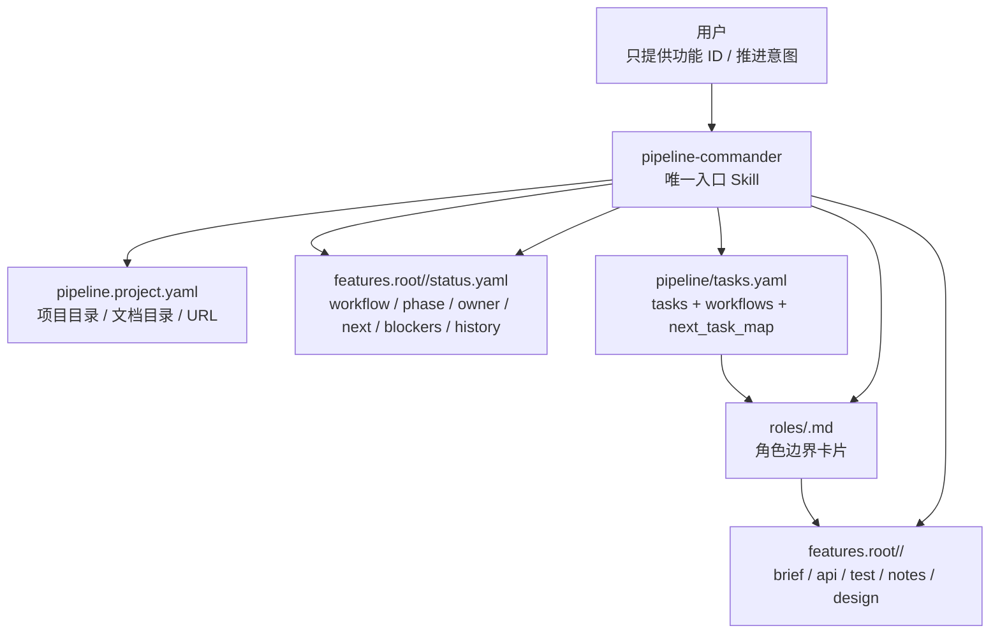
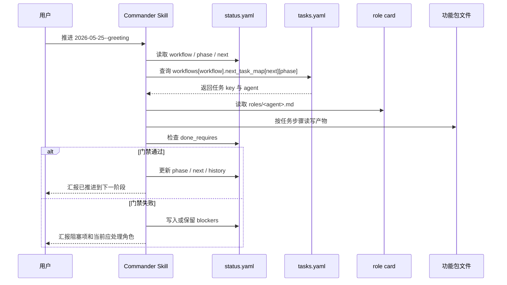
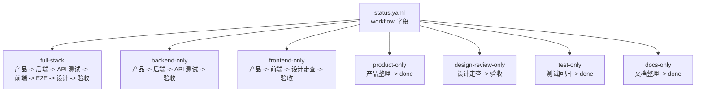
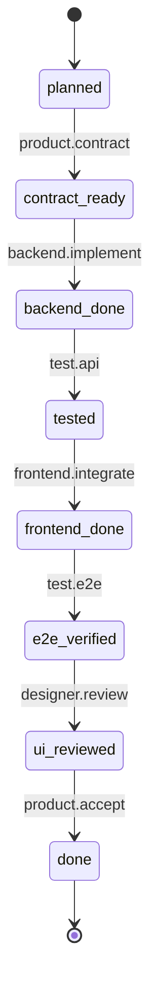
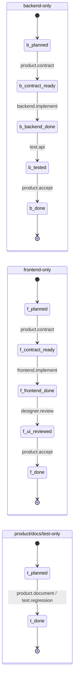
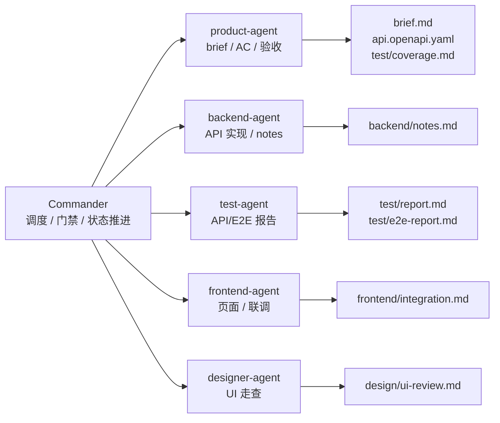

# 轻量级 Agent Pipeline 架构图

## 总览



## 调度流程



## 流程类型



## 全流程状态机



## 常用轻量流程



## 文件责任



## 一句话理解

```text
用户只找 Commander；
Commander 看 status.yaml 的 workflow、phase、next；
tasks.yaml 按 workflow 决定下一个角色；
角色卡限制职责边界；
功能包保存所有交接产物。
```
