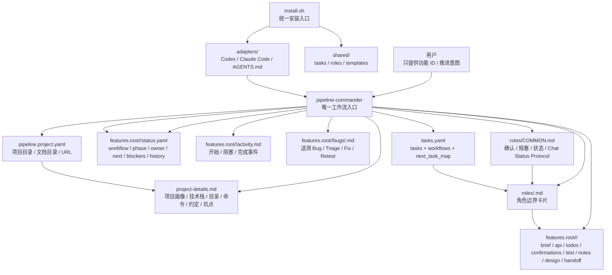
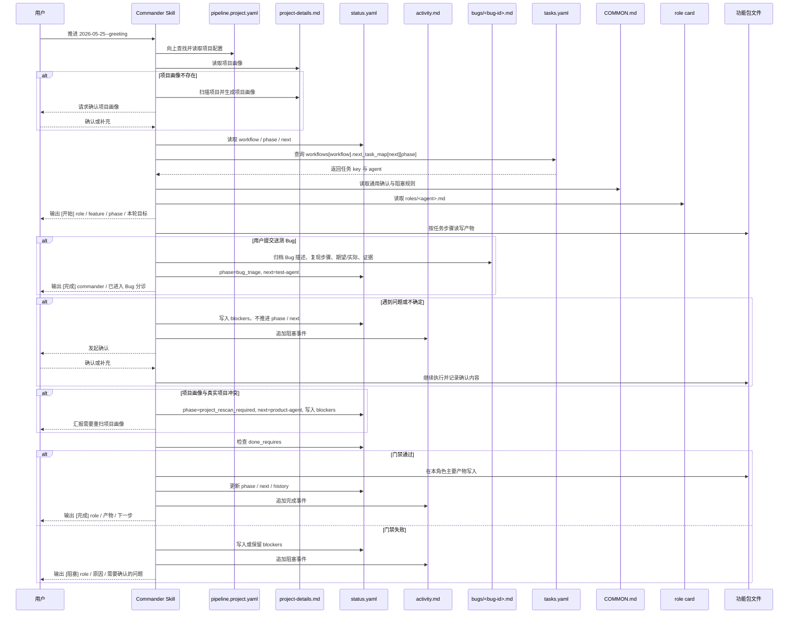
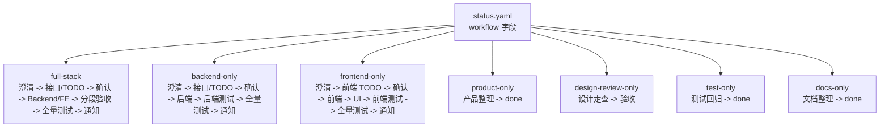
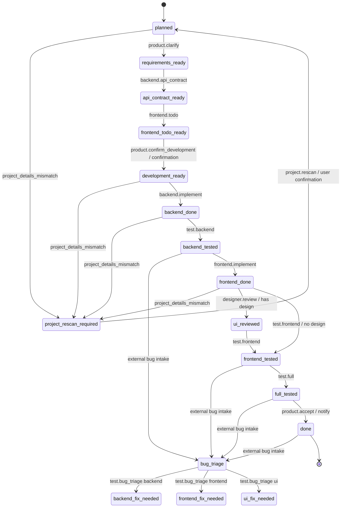
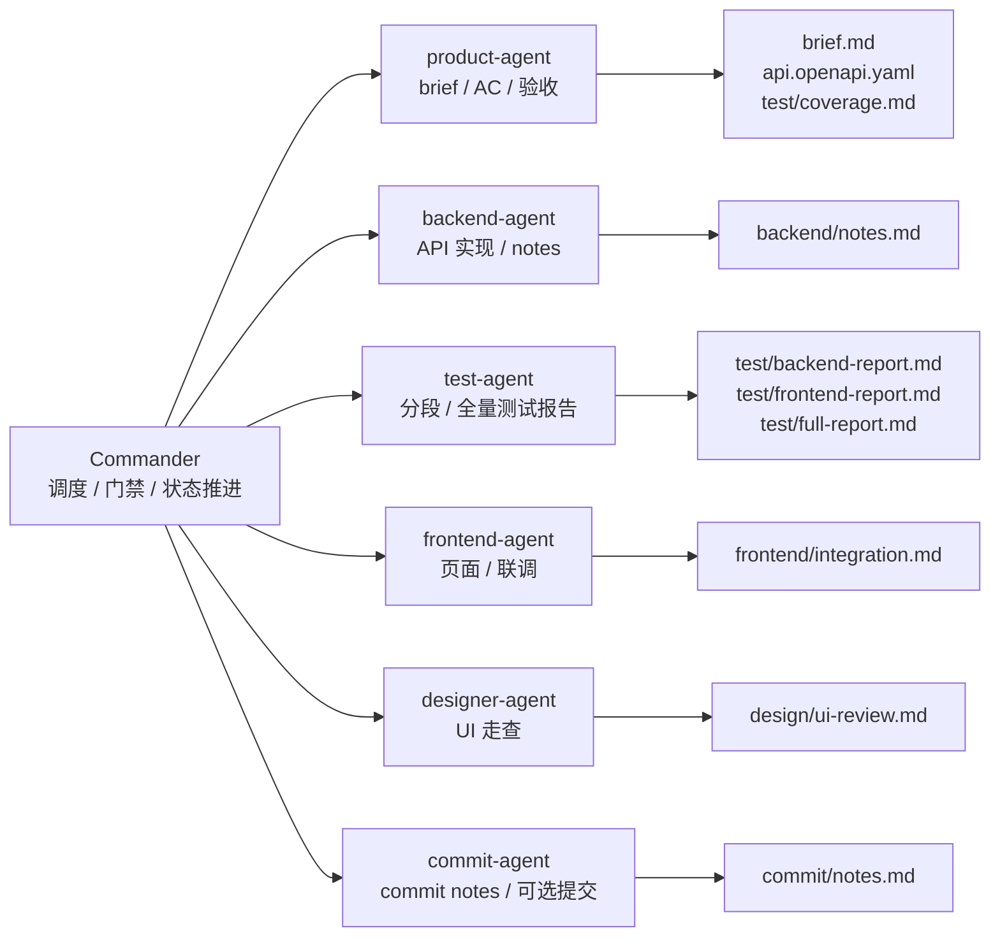

# Agent Pipeline Commander 架构图

## 总览



## 调度流程



## 流程类型



## 全流程状态机

下图按单步推进展示主路径。实际 full-stack 开发在 `development_ready` 后允许 Backend 和 FE 同步推进；如果当前 AI 工具只能单步执行，Commander 需要先向使用者确认优先推进哪个分支。



## 常用轻量流程

```mermaid
stateDiagram-v2
  direction LR

  state "backend-only" as BackendOnly {
    [*] --> b_planned
    b_planned --> b_requirements_ready: product.clarify
    b_requirements_ready --> b_api_contract_ready: backend.api_contract
    b_api_contract_ready --> b_development_ready: product.confirm_development
    b_development_ready --> b_backend_done: backend.implement
    b_backend_done --> b_backend_tested: test.backend
    b_backend_tested --> b_full_tested: test.full
    b_full_tested --> b_done: product.accept
    b_done --> [*]
  }

  state "frontend-only" as FrontendOnly {
    [*] --> f_planned
    f_planned --> f_requirements_ready: product.clarify
    f_requirements_ready --> f_frontend_todo_ready: frontend.todo
    f_frontend_todo_ready --> f_development_ready: product.confirm_development
    f_development_ready --> f_frontend_done: frontend.implement
    f_frontend_done --> f_ui_reviewed: designer.review / has design
    f_frontend_done --> f_frontend_tested: test.frontend / no design
    f_ui_reviewed --> f_frontend_tested: test.frontend
    f_frontend_tested --> f_full_tested: test.full
    f_full_tested --> f_done: product.accept
    f_done --> [*]
  }

  state "product/docs/test-only" as TinyFlows {
    [*] --> t_planned
    t_planned --> t_done: product.document / test.regression
    t_done --> [*]
  }
```



## 文件责任



## 一句话理解

```text
用户只找 Commander；
Commander 看 status.yaml 的 workflow、phase、next；
Commander 每次执行前先读 pipeline.project.yaml 和 project-details.md；
tasks.yaml 按 workflow 决定下一个角色；
角色卡限制职责边界；
功能包保存所有交接产物；
送测 Bug 先写入 bugs/<bug-id>.md，再进入 bug_triage；
前端没有设计材料时可跳过 UI 验收，后补设计稿可单独调用 UI 走查；
用户明确要求提交时临时调用 commit-agent，不默认推进流程；
角色主要产物通过 ## Handoff 标准化交接；
聊天界面输出 [开始] / [阻塞] / [完成] 状态事件；
activity.md 记录关键流程事件；
项目画像错误时中止当前流程，重扫确认后重新开启。
```
